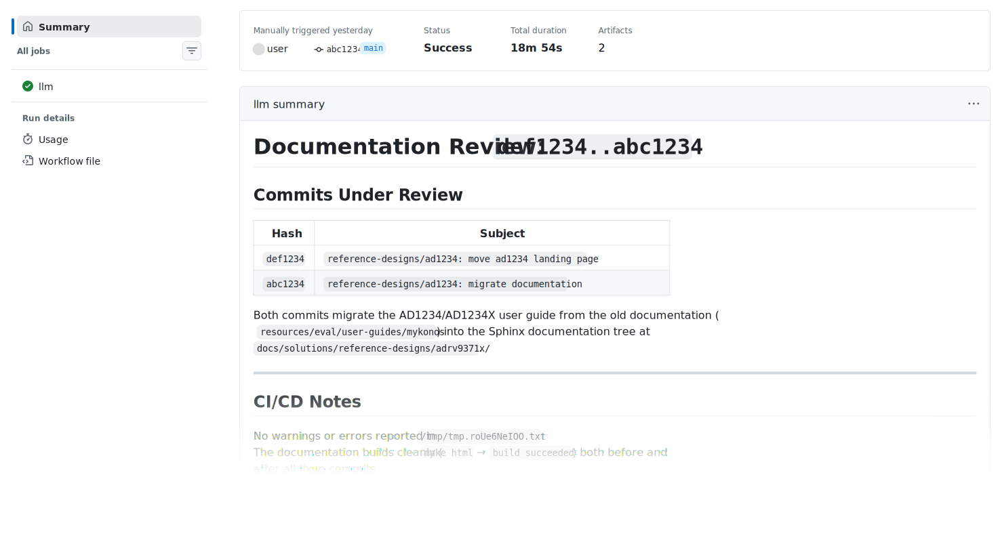

AI Usage
========

For information on Analog Devices Inc. stance on AI usage, please see
:adi:`Responsible AI @ ADI <en/who-we-are/legal-and-risk-oversight/responsible-ai.html>`

Pull request reviewer
---------------------

The PR Agent is an AI-assisted pull request reviewer integrated into our CI/CD
pipeline. It uses the same tooling already present in the workflow to provide
contextual feedback on pull requests. It combines  build checks, static
analysis, style validation, and any other tool that is meaningful for the code
base.
It supports models from multiple vendors, cloud-hosted or self-hosted. The tool
does not approve or merge code; final decisions remain with our reviewers, there
is always a human-in-the-loop.

How it works
~~~~~~~~~~~~

On dispatch, the agent runs in a read-only environment, compiles the code base,
and validates issues and fixes against the actual build output. It then posts
annotated feedback as a GitHub Summary with downloadable git patches and the
agent session.

   LLM run example.

Usage
~~~~~

Access is available to any user with write access to the ``analogdevicesinc``
GitHub organization. For third-party pull requests, an ADI developer can
request a review on your behalf.

The workflow is included in each repository. Go to
``github.com/analogdevicesinc/<repository>/actions/workflows/llm.yml``
(for example, :git+documentation:`actions/workflows/llm.yml <actions/workflows/llm.yml+>`
for this repository), click ``Run workflow``, and enter the pull request number,
branch, or Git SHA to review.

.. svg:: images/llm-dispatch.svg

   How to dispatch a LLM run.

Optional inputs include additional prompt instructions and model size selection.
The default prompt is defined in ``.github/workflows/llm.yml`` of each
repository, for example :git+documentation:`.github/workflows/llm.yml`.
The LLM front-end used is `pi.dev <https://pi.dev/>`__.

Once finished, the GitHub Summary contains the review, and the run artifacts
include git patches with suggested changes and a session file to continue
locally. An example run is available
:git+documentation:`here <actions/runs/24085972371+>`.
