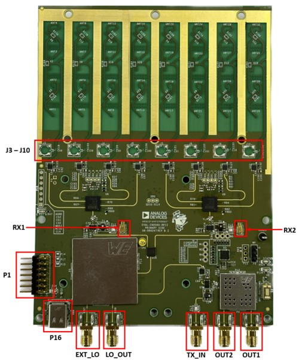

# Phaser RF Overview
## The Phaser RF Board

```{image} blockdiagram.svg
:alt: Phaser Picture
:width: 800px
```
The most prominent feature of the Phaser's RF board is an onboard patch antenna that operates from 10 to 10.5 GHz. Each antenna element is input to an ADL8107, a low noise amplifier (LNA) that operates from 6-18GHz with 1.3dB NF and 24 dB gain. The output of these amplifiers is fed into the main core of this circuitry, two of the ADAR1000. The ADAR1000 is an 8 GHz to 16 GHz, 4-Channel, beamformer that allows per-channel, 360° phase adjustment with 2.8° resolution, and 31dB gain adjustment with 0.5dB resolution. The ADAR1000s are capable of bidirectional, half-duplex operation. However, CN0566 only connects the ADAR1000 receive paths. The outputs of four LNAs get phase and amplitude shifted by an ADAR1000, then summed together at its RFIO output.

The ADAR1000's RFIO port output passes through a low pass filter before entering the LTC5548 mixer. The low pass filter removes the high side image of the mixer as well as any un-wanted signals, spurs or higher order mixing products of the high side LO.
LTC5548 outputs an IF of approximately 2.2 GHz which passes through a low pass filter (LPF) to remove mixer spurs and attenuate any RF or LO leakage. The LPF's output, at Rx1 and Rx2, can then be mixed down and sampled by an external 2-channel SDR receiver, such as the ADALM-Pluto.


## RF Board Port Assignments

```{image} ports.svg
:alt: Phaser Ports
:width: 400px
```
<!-- -->

**J3** to **J10** are the footprints for SMP connectors for use with an external receive antenna

**RX1** is a receive output from the RF board. This is normally cabled to Pluto's RX1 SMA input

**RX2** is the second receive output from the RF board. This is normally cabled to Pluto's RX2 u.FL input

**P1** is the 14-pin header for connection to ADALM-Pluto. This is only used for certain radar timing programs and is not necessary if Phaser's transmit output is not being used

**P16** is the USB-C port for the power supply. It is recommended to connect the USB-C power to this port, and not to the Raspberry Pi's USB-C port. The RF Board will supply the Raspberry Pi with 5V power.

**EXT_LO** is the SMA connector for an optional external LO input. This port is generally not used.

**LO_OUT** is the SMA connector for the LO output. This port is generally not used.

**TX_IN** is the transmit input to the RF board. This is normally cabled to Pluto's Tx2 u.FL port.

**TX_OUT_2** is the SMA connector for the transmit output. This is normally connected to a 10-10.5GHz transmit antenna

**TX_OUT_1** is the SMA connector for the other (switched) transmit output.

## Antenna Numbering and Arrangement

The antenna elements are numbered 1-8.  
* Elements 1-4 correspond to the ADAR1000 identified in the device tree as "BEAM1".  
* Elements 5-8 correspond to the ADAR1000 identified in the device tree as "BEAM0". 


```{image} antenna_numbering.svg
:alt: Antenna Numbering
:width: 700px
```
<!--0-->


```{clear-content}
```
```{note}
For questions or help with the Phaser, please visit:
{ez}`adieducation/university-program`
```


