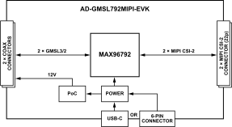

.. _ad-gmsl792mipi-evk:

AD-GMSL792MIPI-EVK
==================

GMSL3/2 Deserializer Board for MIPI CSI-2 Cameras

Overview
--------

.. figure:: images/eval-top-angle.png
    :align: left
    :width: 500 px

    AD-GMSL792MIPI-EVK Board

The :adi:`AD-GMSL792MIPI-EVK` is a compact and cost-effective evaluation kit
that converts dual GMSL3/2 camera links into MIPI CSI-2 for modern SoC
platforms. Built around the :adi:`MAX96792` dual deserializer, it delivers a
robust bridge for vision workloads across automotive and industrial
applications.

To simplify wiring and speed up integration, the board supports a wide
range of image sensors and integrates Power over Coax (PoC) so data and
power travel on a single coaxial cable. The kit also includes ready-to-use
reference software with device-tree overlays and Linux images for
supported camera setups, helping you go from power-up to first frames
fast.

Engineered for quick results, it maintains reliable video over cable up
to 15m length with PAM-4 GMSL3 at 12 Gbps and remains backward
compatible with GMSL2 at 6 Gbps or 3 Gbps. A bidirectional I²C control
channel streamlines camera configuration while the small footprint and
flexible mounting make it ideal for rapid GMSL3 camera prototyping.

Features
--------

- Dual GMSL3/2 deserializer based on MAX96792
- 2 × MIPI CSI-2 output connectors
  (each up to 4 lanes D-PHY at 2.5 Gbps/lane)
- 2 × GMSL input connectors over 50Ω coax
- Power over Coax implementation, 12V, 1.2A total output
- USB-C 5V input or 6-pin header alternative power input
- Compatible with NVIDIA Jetson, Raspberry Pi, and AMD SoC
  platforms
- Independent MIPI CSI-2 connector operation available
- Small form factor, mounting compatible with Raspberry Pi

Applications
------------

- Advanced driver assistance systems (ADAS)
- Mobile and mounted robotics
- Autonomous vehicles and automotive cameras
- Outdoor machines and industrial equipment
- Smart and flexible manufacturing systems
- Security and surveillance systems
- Industrial automation and machine vision

Specifications
--------------

+------------------------+----------------------------------------------+
| Parameter              | Specification                                |
+========================+==============================================+
| GMSL3/2 Inputs         | 2 channels, 12Gbps / 6Gbps / 3Gbps           |
|                        | configurable                                 |
+------------------------+----------------------------------------------+
| MIPI CSI-2 Outputs     | 2 × 4-lane ports, up to 2.5Gbps per lane     |
+------------------------+----------------------------------------------+
| Power Input            | USB-C or via the 6-pin connector, 5V ±5%     |
+------------------------+----------------------------------------------+
| PoC Output             | 12V, 1.2A total                              |
+------------------------+----------------------------------------------+
| Cable Length           | Up to 15 meters                              |
+------------------------+----------------------------------------------+
| Key Components         | MAX96792A, LTC3303                           |
+------------------------+----------------------------------------------+

System Architecture
-------------------

  AD-GMSL792MIPI-EVK System Architecture

Forward Path (Camera to SoC):
~~~~~~~~~~~~~~~~~~~~~~~~~~~~~

1.	Camera sensor captures image data
2.	GMSL3/2 serializer converts parallel data to serial stream
3.	Data transmitted over coaxial cable at the specified data rate
4.	MAX96792A deserializer receives GMSL3/2 data
5.	Data converted to MIPI CSI-2 format
6.	MIPI CSI-2 output connects to SoC platform

Reverse Path (SoC to Camera):
~~~~~~~~~~~~~~~~~~~~~~~~~~~~~

1.	Control commands originate from SoC platform
2.	I2C/control signals processed by MAX96792A
3.	Commands transmitted over GMSL3/2 reverse channel at 187.5Mbps
4.	Serializer receives and processes control commands
5.	Commands applied to camera sensor and peripherals

Power Distribution:
~~~~~~~~~~~~~~~~~~~

1.	5V input power received via USB-C connector or via the 6-pin connector
2.	LTC3303 regulator converts 5V to required board voltages: 1.8V and 1.2V
3.	PoC circuit using LT8337JV generates 12V output for camera power
4.	Power delivered to camera through coaxial cable

What's Inside the Box
-----------------------

- AD-GMSL792MIPI-EVK evaluation board
- ESW-103-44-G-D 6POS dual row connector
- 05-22-D-0050-A-4-06-4-T FFC 22POS 50 mm cable
- FF3025-CO102-022 FFC 22POS 102 mm cable
- 8 x screws
- 4 x 21 mm standoffs

----

Components and Connections
--------------------------

Primary Side
~~~~~~~~~~~~~

- DS1 LED - indicates 5V USB-C input
- DS2 LED - indicates 1.8V rail
- P5 Connector - alternative 5V input and Raspberry Pi shield
  (same nets as Raspberry Pi's GPIOs)
- S1 Power Switch

    -  Up = USB-C power
    - Down = P5 power

- J1/J2 FAKRA-HF Coax Connectors - GMSL3/2 data + PoC
  (12V, 1.2A)
- P1/P2 22-pin FFC Connectors - MIPI CSI-2 outputs
- PoC Circuitry - delivers camera power over coax

Hardware Setup
---------------

**Equipment Needed**

- AD-GMSL792MIPI-EVK evaluation board
- Compatible SoC development platform (Jetson, Raspberry Pi, AMD)
- GMSL3/2 camera with serializer (for example, AD-GMSL793MIPI-EVK)
- Coaxial cable (50Ω)
- MIPI CSI-2 FFC/FPC cable (22-pin)
- USB-C power supply (5V, minimum 2A)
- Multimeter (for verification)

.. figure:: images/hardware-setup.png

    AD-GMSL792MIPI-EVK Hardware Connection

Power System Verification
~~~~~~~~~~~~~~~~~~~~~~~~~

- Ensure all power sources are disconnected.
- Verify USB-C power supply specifications (5V ±5%).
- Place the switch in the first (upper) position.
- Connect USB-C power cable to board.

GMSL3/2 Camera Connection
~~~~~~~~~~~~~~~~~~~~~~~~~

- Connect GMSL3/2 camera to coaxial cable.
- Verify cable specifications (50Ω coax).
- Connect cable to any of the GMSL connectors.
- Ensure secure mechanical connection.

SoC Platform Connection
~~~~~~~~~~~~~~~~~~~~~~~

- Select appropriate MIPI CSI-2 FPC cable.
- Connect board MIPI output to SoC platform CSI-2 input.
- Verify pin compatibility and orientation.
- Secure cable connections.

Configuration Setup
~~~~~~~~~~~~~~~~~~~

- Set SW1 for appropriate link speed (3Gbps/6Gbps).
- Configure SW2 for I2C device address if needed.
- Set SW3 for operating mode (pixel/tunneling).

Power-Up Sequence
~~~~~~~~~~~~~~~~~

- Apply power via USB-C connector.
- Verify led illumination.
- Check for GMSL3/2 link lock.
- Monitor MIPI activity indicators.

Sample Measurements and Expected Readings
~~~~~~~~~~~~~~~~~~~~~~~~~~~~~~~~~~~~~~~~~

+----------------------------------+--------------------------------+
| Parameter                        | Expected Reading               |
+==================================+================================+
| Supply voltage at USB-C input    | 5.0V ±0.25V                    |
+----------------------------------+--------------------------------+
| PoC output voltage               | 12.0V ±0.5V                    |
+----------------------------------+--------------------------------+
| PoC output current               | Up to 1.2A                     |
+----------------------------------+--------------------------------+
| Link lock time                   | < 100ms typical                |
+----------------------------------+--------------------------------+
| MIPI CSI-2 output levels         | MIPI D-PHY v1.2 compliant      |
+----------------------------------+--------------------------------+

Software
--------

The GMSL software package provides comprehensive driver support
and configuration tools for integrating GMSL3/2 cameras with
popular SoC platforms. The software includes device tree configuration
and kernel drivers.

Access the resources via the :git-gmsl:`Analog Devices GMSL GitHub repository </>`.

----

Resources
---------

- :adi:`MAX96792A Product Page <max96792a>`
- :adi:`LTC3303 Product Page <ltc3303>`
- :adi:`GMSL3 Channel Specification User Guide <media/en/technical-documentation/user-guides/gmsl3-channel-specification-user-guide.pdf>`

Design & Integration Files
~~~~~~~~~~~~~~~~~~~~~~~~~~

.. admonition:: Download

     :download:`AD-GMSL792MIPI-EVK Design Support Package <files/design-support.zip>`

     - Schematic
     - PCB Layout
     - Bill of Materials
     - Allegro Project

Help and Support
~~~~~~~~~~~~~~~~

Analog Devices will provide **limited** online support for anyone using the
reference design with Analog Devices components via the
:ez:`EngineerZone reference designs <reference-designs>` forum.

It should be noted that the older the tools' versions and release branches are,
the lower the chances to receive support from ADI engineers.
