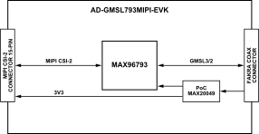

.. _ad-gmsl793mipi-evk:

AD-GMSL793MIPI-EVK
==================

GMSL3/2 Deserializer Board for MIPI CSI-2 Cameras

Overview
--------

.. figure:: images/eval-top-angle.png
  :align: left
  :width: 200 px

  AD-GMSL793MIPI-EVK Board

The :adi:`AD-GMSL793MIPI-EVK` is a compact evaluation board that bridges a
MIPI CSI-2 camera interface to a single GMSL3 or GMSL2 serial link
using the :adi:`MAX96793` serializer. It is the next-generation counterpart
to the AD-GMSL717MIPI-EVK concept, extending the serializer side from
GMSL2 to GMSL3 at up to 12Gbps forward-link rate, while retaining
backward compatibility with GMSL2 at 6Gbps or 3Gbps for broader
ecosystem support.

The board is intended for rapid evaluation of MIPI camera modules in
systems that use GMSL transport to connect remote cameras to
centralized processing platforms. Like the AD-GMSL717MIPI-EVK, the
board is designed around a compact mechanical format for easy
integration into robotics, machine vision, automotive prototyping,
and embedded imaging systems.

When paired with a compatible deserializer platform such as the
AD-GMSL792MIPI-EVK board, the AD-GMSL793MIPI-EVK can be used as the
serializer-side endpoint in a complete MIPI-to-GMSL3/GMSL2-to-MIPI
evaluation chain.

Features
--------

- MAX96793-based MIPI CSI-2 to GMSL3/GMSL2 serializer
- 12Gbps GMSL3 forward link, backward compatible with 6Gbps/3Gbps
  GMSL2
- Single MIPI CSI-2 input with support for up to 4 D-PHY lanes at
  2.5Gbps/lane
- Single GMSL output over 50Ω coax
- 187.5Mbps bidirectional control channel with I²C and GPIO support
- Compact camera-side EVK form factor based on the
  AD-GMSL717MIPI-EVK concept

Applications
------------

- Advanced Driver Assistance Systems (ADAS) camera prototyping
- Embedded vision and robotics
- Industrial automation and machine vision
- High-resolution remote cameras and distributed sensing nodes
- Development of next-generation GMSL3 camera links with fallback to
  GMSL2

Specifications
--------------

+------------------------------+------------------------------------------+
| Parameter                    | Specification                            |
+==============================+==========================================+
| Camera Input                 | MIPI CSI-2 v1.3 input to serializer      |
+------------------------------+------------------------------------------+
| GMSL3/2 Output Forward Link  | 12Gbps GMSL3, backward compatible with   |
|                              | 6Gbps / 3Gbps GMSL2 over 50Ω coax cable  |
+------------------------------+------------------------------------------+
| PoC Input                    | 5V to 17V input range,                   |
|                              | optimized for 12V operation              |
+------------------------------+------------------------------------------+
| Cable Length                 | Up to 15 meters                          |
+------------------------------+------------------------------------------+
| Key Components               | MAX96793, MAX20049                       |
+------------------------------+------------------------------------------+

System Architecture
-------------------

  AD-GMSL793MIPI-EVK System Architecture

Forward Path (Camera to SoC):
~~~~~~~~~~~~~~~~~~~~~~~~~~~~~

A camera module outputs video over MIPI CSI-2 into the
AD-GMSL793MIPI-EVK input connector. The MAX96793 serializes the
CSI-2 stream and transmits it over a single coaxial link using
12Gbps GMSL3 or 6Gbps /3Gbps GMSL2 operation, depending on system
configuration and companion deserializer capability.

Reverse Path (SoC to Camera):
~~~~~~~~~~~~~~~~~~~~~~~~~~~~~

The control path runs back over the same physical link using the
device's 187.5Mbps reverse channel. This path carries I²C/UART
pass-through traffic, configuration transactions, GPIO-related
control, and optional tunneled peripheral communications supported
by the serializer device.

Power Distribution:
~~~~~~~~~~~~~~~~~~~

AD-GMSL793MIPI-EVK implements power over cable so the remote
serializer side can be powered from the link side without a separate
local supply. The MAX20049 companion PMIC family is explicitly
positioned as a compact multi-rail camera power solution for
automotive/remote camera modules.

What's Inside the Box
-----------------------

- AD-GMSL793MIPI-EVK evaluation board
- 05-22-D-0050-A-4-06-4-T FFC 22POS 50 mm cable
- 8 x screws
- 4 x 10 mm standoffs

----

Hardware Setup
---------------

**Equipment Needed**

- AD-GMSL793MIPI-EVK evaluation board
- Compatible SoC development platform (Jetson, Raspberry Pi, AMD)
- GMSL3/2 camera with deserializer (for example, AD-GMSL792MIPI-EVK)
- Coaxial cable (50Ω)
- MIPI CSI-2 FFC/FPC cable (15-pin)
- USB-C power supply (5V, minimum 2A)
- Multimeter (for verification)

.. figure:: images/hardware-setup.png

  AD-GMSL793MIPI-EVK Hardware Connection

Power System Verification
~~~~~~~~~~~~~~~~~~~~~~~~~

- Ensure all power sources are disconnected.
- Verify USB-C power supply specifications (5V ±5%).
- Place the switch in the first (upper) position.
- Connect USB-C power cable to board.

GMSL3/2 Camera Connection
~~~~~~~~~~~~~~~~~~~~~~~~~

- Connect GMSL3/2 camera to coaxial cable.
- Verify cable specifications (50Ω coax).
- Connect cable to any of the GMSL connectors.
- Ensure secure mechanical connection.

SoC Platform Connection
~~~~~~~~~~~~~~~~~~~~~~~

- Select appropriate MIPI CSI-2 FPC cable.
- Connect board MIPI output to SoC platform CSI-2 input.
- Verify pin compatibility and orientation.
- Secure cable connections.

Configuration Setup
~~~~~~~~~~~~~~~~~~~

- Set SW1 for appropriate link speed (3Gbps/6Gbps).
- Configure SW2 for I2C device address if needed.
- Set SW3 for operating mode (pixel/tunneling).

Power-Up Sequence
~~~~~~~~~~~~~~~~~

- Apply power via USB-C connector.
- Verify led illumination.
- Check for GMSL3/2 link lock.
- Monitor MIPI activity indicators.

Sample Measurements and Expected Readings
~~~~~~~~~~~~~~~~~~~~~~~~~~~~~~~~~~~~~~~~~

+----------------------------------+--------------------------------+
| Parameter                        | Expected Reading               |
+==================================+================================+
| Supply voltage at USB-C input    | 5.0V ±0.25V                    |
+----------------------------------+--------------------------------+
| PoC output voltage               | 12.0V ±0.5V, up to 1.2A        |
+----------------------------------+--------------------------------+
| Link lock time                   | <100ms typical                 |
+----------------------------------+--------------------------------+
| MIPI CSI-2 output levels         | MIPI D-PHY v1.2 compliant      |
+----------------------------------+--------------------------------+

Software
--------

The GMSL software package provides comprehensive driver support
and configuration tools for integrating GMSL3/2 cameras with
popular SoC platforms. The software includes device tree
configuration and kernel drivers.

Access the resources via the :git-gmsl:`Analog Devices GMSL
GitHub repository </>`.

----

Resources
---------

- :adi:`MAX96793 Product Page <max96793>`
- :adi:`LTC3303 Product Page <ltc3303>`
- :adi:`GMSL3 Channel Specification User Guide <media/en/technical-documentation/user-guides/gmsl3-channel-specification-user-guide.pdf>`

Design & Integration Files
~~~~~~~~~~~~~~~~~~~~~~~~~~

.. admonition:: Download

   :download:`AD-GMSL793MIPI-EVK Design Support Package <AD-GMSL793MIPI-EVK-designsupport.zip>`

   - Schematic
   - PCB Layout
   - Bill of Materials
   - Allegro Project

Help and Support
~~~~~~~~~~~~~~~~

Analog Devices will provide **limited** online support for anyone
using the reference design with Analog Devices components via the
:ez:`EngineerZone reference designs <reference-designs>` forum.

It should be noted that the older the tools' versions and release
branches are, the lower the chances to receive support from ADI
engineers.
