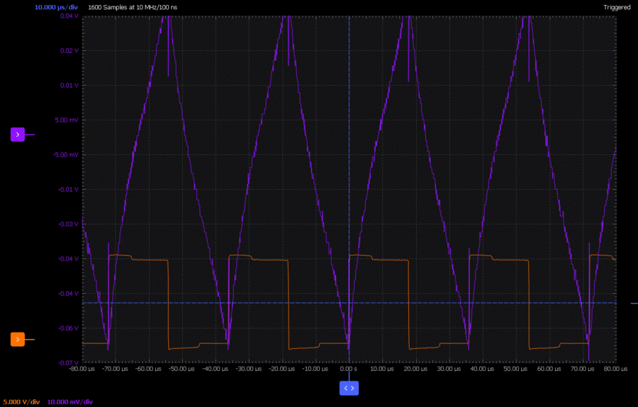
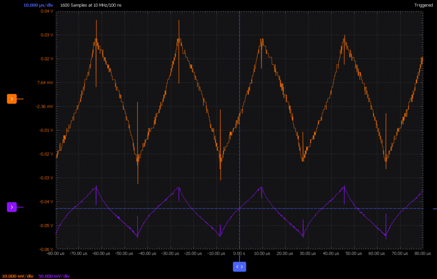

Activity: Buck Converter Basics
===============================

Objective:
----------

The objective of this activity is to explore some basic principles of a buck
converter, a power conversion circuit that efficiently produces an output
voltage that is lower than the supplied voltage:

-  Inductor characteristics (current / voltage / time relationships)
-  Volt-second balance
-  Pulse-Width Modulation
-  Inductor current ripple
-  Output voltage ripple
-  Open-loop vs. closed loop operation
-  Voltage-mode control

Workshop Slide Deck
-------------------

A slide deck is provided as a companion to this exercise, and can be used to
help in presenting this material in classroom, lab setting, or in hands-on
workshops.

.. ADMONITION:: Download

   :download:`Buck Converter Basics Slide Deck <workshop_buck_converter_basics.pptx>`

Background:
-----------

Most electrical engineers and students are familiar with linear voltage
regulators, such as the LM7805 positive 5V regulator or the LM317 adjustable
positive regulator. Linear regulators are suitable for applications in which one
of the following is true:

-  Small load current drawn from the regulated output (where the input voltage
   might be much higher than the output voltage)

|image1|

Figure 1. LDO with high voltage drop, low output
current

-  Large load current drawn from the regulated output (where there is a small
   difference between the unregulated input voltage and the regulated output
   voltage)

|image2|  Figure 2. LDO with low voltage drop, high output
current

The reason for the conditions on current and input-output voltage difference is
that the linear regulator will always dissipate the product of the output
current and this voltage difference as heat. The following figure shows a
situation in which 3.5 watts of power will need to be dealt with, using a large
heat sink, fan, or both. |image3|  Figure 3. LDO with high
voltage drop, high output current

Heat sinks are large, expensive, and lose effectiveness if they accumulate dust.
Fans are loud and have limited lifetimes. And of course, electrical power lost
as heat costs just as much as power that does something useful in your circuit.
This is where buck converters are useful.

*Note that all schematics are included as LTspice files, with simulation
parameters set up and ready to run. Run these simulations, and experiment with
different component values, voltages, etc.*

Materials
~~~~~~~~~

| ADALM2000 Active Learning Module
| PC running LTspice and Scopy
| Solder-less breadboard and jumper wire kit or Perma Proto solder breadboard
| ADALP2000 parts kit parts as required
| Optional: :dokuwiki:`ADALM-BUCK-ARDZ Module </university/tools/lab_hw/adalm_buck>`
| 12V power supply (preferred) or 5V USB power supply (workable)
| Voltmeter (optional, can use M2K in Voltmeter mode.)
| LTspice files for this activity:
  `buck_ltspice <https://analogdevicesinc.github.io/DownGit/#/home?url=https://github.com/analogdevicesinc/education_tools/tree/master/m2k/ltspice/buck_ltspice>`__

Activity 1: An Open-Loop 2:1 Buck Converter
-------------------------------------------

Theory and Simulation
~~~~~~~~~~~~~~~~~~~~~

Simulation using ideal components
^^^^^^^^^^^^^^^^^^^^^^^^^^^^^^^^^

Open the Buck_Concept.asc LTspice file. The figure below shows one of the two
states of the circuit's operation, where S1 is closed and S2 is open.

|image4|  Figure 4. Buck converter top switch closed

Assume Vout is some voltage between zero (ground) and Vin (5V). When S1 closes,
the lefthand side of inductor L1 is connected to the 5V supply, and the current
through L1 ramps up with a slope of:

.. math::

   di/dt = (5.0-V_{OUT})/L1

The next figure shows the other state, with S1 open and S2 closed.

|image5|  Figure 5. Buck converter bottom switch closed

When S2 closes, the lefthand side of inductor L1 is connected to ground, and the
current through L1 decreases with a slope of:

.. math::

   di/dt = (0-V_{OUT})/L1

The "freq" and "duty" parameters set the frequency of the switching to 25kHz and
the duty cycle of the voltages imposed on this switch node (sw_node) to 50%.
That is, the lefthand side of the inductor spends half of the time connected to
the input supply, and half of the time connected to ground. Run the simulation,
and probe sw_node, Vout, and the current through inductor L1. Zoom in toward the
end of the run after the startup transient damps out. (You can right-click,
Autorange y-axis to line up the two waveforms.)

|image6|  Figure 6. Inductor current, switch node, output

Hover the cursor over the peak and valley of the I(L1) waveform, noting the
current values. (We already know the high time and low time of the waveform -
the period is 1/25kHz, or 40us, and the duty cycle is 50%, so the high time and
low time are both 20 microseconds.)

The output voltage looks like it is approximately 2.5V, with some "ripple"
superimposed. If this is the case, verify that these equations hold true:

.. math::

   di/dt = (5.0V-2.5V)/(100uH)

.. math::

   di/dt = (-2.5V)/(100uH)

The output voltage **looks** close to 2.5V, but is it **exactly** 2.5V? One of
the basic assumptions of an inductor's operation in a circuit is that the DC
(steady-state) voltage across an ideal inductor is zero. To see why, let's try
to go against this rule. Open the *"runaway_inductor.asc"* LTspice simulation:

|image7|  Figure 7. Runaway Inductor Schematic

and run it, probing the inductor current:

|image8|  Figure 8. Runaway Inductor Current

The simulation applies the same 5V across the same 100uH inductor, but instead
of switching at 25kHz, the voltage source is left connected continuously. The
simulation steps through four values of inductor DC resistance (all inductors
have some resistance, usually specified in the inductor's datasheet.) The first
resistance is very small, a close-to-ideal 1 micro-ohm (LTspice does not allow a
value of true zero). The current climbs almost linearly to 500 amps in 10
milliseconds! Even with higher resistances of one milliohm, ten milliohms, and
0.1 ohms, currents are still unrealistically high for the experiments we will be
doing shortly. (A simulation is very useful for exploring "what if?" situations
in a circuit that would not be possible in a real experiment.)

So how can we apply this rule of zero DC across an inductor to find the output
voltage of a buck converter, knowing the duty cycle? "Zero DC across an
inductor" means that if a voltage is applied in one polarity for a given time,
imposing a certain volt-second product, an equal but opposite volt-second
product must also be applied, such that over a long period of time, the average
volt-second product is zero. Thus:

.. math::

   (V_{IN} - V_{OUT}) * t_{S1} = 0V - V_{OUT} * t_{S2}S

where tS1 is the time that S1 is closed, tS2 is the time that S2 is closed.

Solving for Vout:

.. math::

   V_{OUT} = V_{IN} * t_{S1}/(t_S1 + t_{S2})

Noting that

.. math::

   t_{S1}/(t_{S1} + t_{S2})

is the duty cycle of the sw_node waveform:

.. math::

   V_{OUT} = V_{IN} * Duty Cycle

So for a 50% duty cycle, the output voltage is half of the input voltage.

Simulation using "simulated real" components
^^^^^^^^^^^^^^^^^^^^^^^^^^^^^^^^^^^^^^^^^^^^

While normally intended as a switched-capacitor converter, the LT1054 can be
configured to illustrate the basic operation of a buck converter. The CAP+ pin
is a convenient "push-pull driver" that is alternately connected to the input
supply (VIN pin) and ground (GND pin). The LT1054 has a built-in 25kHz, 50% duty
cycle oscillator, so a fixed 2:1 ratio buck converter can be easily implemented.

Open LT1054_2to1_buck.asc in LTspice, and run the simulation.

|image9|  Figure 9. Open-loop 2:1 Buck Converter

A few things to note about the LTspice schematic: The Coilcraft HPH1-1400L
6-winding transformer allows the circuit to be simulated / tested with several
different values of inductance. The "K1 L1 L2 L3 L4 L5 L6 0.95" statement tells
LTspice that the windings are on the same core (coupled), rather than discrete
inductors. This means that the inductance will increase by the square of the
number of inductors connected in series: 202uH for a single inductor, and 202uH
\* 36 = 7.2mH when all six inductors are connected in series.

Note that the circuit elements in dashed boxes apply stimulus for the
simulation, with opening and closing of switches representing the connection or
disconnection of a jumper wire on your breadboard.

The figure below shows the turn-on transient of the circuit, with ringing due to
resonance between the inductor and output capacitance, which is damped out by
the load resistance. At 4 milliseconds, a 50-ohm load is connected to the
output, causing a drop in the output voltage. This drop is due to finite
impedances in the LT1054's switches, as well as the inductor's DC resistance.

|image10|  Figure 10. Turn-on and Load Step Transients

Ripple Current and Ripple Voltage
^^^^^^^^^^^^^^^^^^^^^^^^^^^^^^^^^

Now we've got a circuit that efficiently converts one voltage to another,
without burning lots of power. In fact if you had an application where there was
a well-regulated 12V power supply available, and a downstream circuit needed a
"not-too-well-regulated" 6V supply, this buck converter might be perfectly
appropriate. Let's start examining some of the imperfections and decisions
involved in designing a buck converter. One of the most important is the
selection of the inductor value. Even when the output is unloaded, there will be
a "ripple current" always flowing in the inductor as the input side of the
inductor is alternately connected to the high-voltage input supply and ground.
The peak-to-peak ripple current can be calculated as:

.. math::

    \Delta I_{L(p-p)} = \frac{(V_{IN}-V_{O})*V_{O}/V_{IN}}{L*f_S}

So a higher inductance would seem to be better, as the ripple current is
proportionally lower. However, it takes more wire to make a higher-value
inductor, and the resistance will be higher. There are often limitations on how
physically large an inductor can be as well; portable electronics often require
circuits to be as small as practical, and sometimes as small as physically
possible. In general, a peak-to-peak ripple current is chosen to be between 10%
and 60% of the DC output current.

Why does ripple current matter? Ideally, any DC-DC converter (LDO, Buck, Boost,
etc.) produces a stable, low-noise output voltage from an imperfect (noisy,
variable) input voltage. Ripple current induces a corresponding ripple in the
regulated output voltage, as the ripple current charges and discharges the
output capacitance by a small amount. Ripple voltage can be calculated as:

.. math::

    \Delta V_{OUT} \approx I_{L(p-p)} * \left( ESR + \frac{1}{8*f_S*C_{OUT}} \right)

So a higher output capacitance will result in a lower ripple voltage. But as
with the inductor, there are often limitations on how physically large a
capacitor can be. Also note the "ESR" term, which is the equivalent series
resistance of the capacitor. This resistance will be listed in a capacitor's
datasheet.

The LT1054_2to1_buck.asc simulation allows you to easily experiment with
different inductances and capacitances. Try connecting the input side of R1 (the
current-sense reistor) to the various "taps" in the series-connected inductors.
For each run, probe the current in R1 and the voltage at Vout. The figure below
shows a stepped simulation, for between 1 and 6 of the HPH1-1400L's inductors
connected in series:

|image13|  Figure 11. Inductor Ripple Current and Output
Ripple Voltage

With the green trace showing a decreasing ripple current with increasing
inductance, and the red trace showing a corresponding decrease in ripple
voltage... accompanied by poorer load regulation due to the increased resistance
of the windings. (Try increasing the .param dcr to 0.5 ohms to make this effect
more apparent.)

Circuit Construction and Testing
~~~~~~~~~~~~~~~~~~~~~~~~~~~~~~~~

Build the following breadboard circuit for the buck converter, following the
schematic in Figure 16. (Q1, R2, R3 can be added later.) Note that the
HPH1-1400L has six inductors that can be connected in any way (series, parallel,
or a combination of the two). Be sure to observe proper polarity, connecting all
inductors in series as shown. <WRAP info> The circuits in this lab are
compatible with solderless breadboard construction. However they are relatively
complicated and take time to construct and debug. The :dokuwiki:`ADALM-BUCK-ARDZ Module </university/tools/lab_hw/adalm_buck>` is available as an alternative.

|image14|  Figure 12. Breadboard Circuit

The circuit can also be soldered on a "Perma Proto" solderable breadboard from
Adafruit or DigiKey SolderFul breadboard, which match the layout of typical solderless breadboards.

|image15|  Figure 13. Alternate Construction Method

Measure the ripple current for different numbers of series-connected inductors.
The animated figure below shows the ripple current for 2, 3, 4, 5, and 6
inductors. How well does this match the LTspice simulation?

|image16|  Figure 14. Ripple Current for 2 to 6 Windings in
Series

.. note::

   Notice the "steps" in the switch node voltage as the inductor current passes
   through zero. After switching, current initially flows through diodes D1 or D2.
   As the current passes through zero and switches direction, the LT1054 output
   driver "takes over" and drives the switch node. In the LTspice simulation, try
   probing the LT1054 CAP+ current, D1 current, and D2 current separately, noting
   that the inductor current is the sum of the three.

Measure the ripple voltage at the output of the converter, with a 22uF output
capacitor. Then place an additional 47uF capacitor in parallel, for a total of
69uF. Does the measured ripple match the simulated ripple reasonably well? Note
that both the inductor and electrolytic capacitors can have a very wide
tolerance - tolerances of +/-20% are common for inductors, and -20%/+80% is a
common tolerance for electrolytic capacitors.

The animated figure below shows the ripple voltage for output capacitances of
22uF and 22uF+47uF. |image17|  Figure 15. Output Ripple for
22uF, 22+47uF output capacitance

Activity 2: An Open-Loop Variable Buck Converter
------------------------------------------------

.. _theory-and-simulation-1:

Theory and Simulation
~~~~~~~~~~~~~~~~~~~~~

The LT1054's internal oscillator can be overridden with a simple external
circuit shown in the datasheet, allowing the frequency and duty cycle to be
changed. Add this circuit to your breadboard, and connect to digital I/O DIO 0
on the M2K, or to a benchtop pulse generator.

This circuit is also included in the LT1054_buck_complete.asc LTspice
simulation. (Ignore the text in the dashed box, we'll get to that in the next
experiment!)

|image18|  Figure 16. Buck Converter with Internal Oscillator
Override

Open the circuit and run the simulation; the duty cycle and frequency are
parameterized so that they can be easily changed. Test several values of the
duty cycle (20%, 40%, 60%, 80%), show that VOUT = VIN \* Duty Cycle

.. _circuit-construction-and-testing-1:

Circuit Construction and Testing
~~~~~~~~~~~~~~~~~~~~~~~~~~~~~~~~

Use M2K to override the LT1054's internal oscillator. Open Scopy's pattern
generator, and take measurements at 20%, 40%, 60%, 80% duty cycle. <<add setup
details, make a Scopy ini file.>> Set back to 50%, then connect a 50-ohm load.
Calculate the approximate output impedance.

Activity 3: A closed-Loop, Voltage Mode Buck Converter
------------------------------------------------------

.. _theory-and-simulation-2:

Theory and Simulation
~~~~~~~~~~~~~~~~~~~~~

Obviously, sensitivity to input voltage changes and output loading is
undesirable. The figure below shows a feedback path that observes the output
voltage, and adjusts the duty cycle accordingly. That is, if the load increases,
causing a drop in output voltage, this will be sensed by "something" that will
increase the duty cycle to compensate and bring the output voltage back to it's
desired value. There are various ways to accomplish this: we'll leave it as an
extra activity to close loop in (either in LTspice or on the breadboard) using a
voltage reference, op-amp, and an LTC6992 PWM generator. The result will be a
true voltage-mode buck converter.

This feedback path can be implemented in another way - using a
software-programmable feedback loop. The M2K already has the required elements -
it can measure the output voltage, and control the duty cycle of a digital
output. Scopy includes a "debug mode" that allows interaction with JavaScript
programs, and a script is included in the resources section that does this.

Yet another way is to use an Arduino Uno microcontroller to close the loop. The
Uno has 6 analog inputs, one of which can be used to measure the output voltage.
It also includes several PWM outputs, that can be used to control the duty cycle
of the LT1054.

.. _circuit-construction-and-testing-2:

Circuit Construction and Testing
~~~~~~~~~~~~~~~~~~~~~~~~~~~~~~~~

Connect the buck output to the A0 analog pin on the Arduino and the Arduino's D3
digital signal to the buck converter's control input. Figure 17 shows
connections to an Arduino Uno clone. The yellow wire connects the buck output to
the Arduino's A0 input, and the blue wire connects the Arduino's PWM output on
Digital Pin 3 to the oscillator override input. (Using two ground wires ensures
a lower inductance connection between circuit grounds.)

|image19|  Figure 17. Buck Converter with Arduino Control

Copy this Arduino sketch into your Arduino sketchbook (and restart the Arduino
IDE if it's open.) <WRAP round download>

.. ADMONITION:: Download

   :download:`Arduino Sketch: `LT1054 closed loop buck with duty cycle control <https://analogdevicesinc.github.io/DownGit/#/home?url=https://github.com/analogdevicesinc/Linduino/tree/master/LTSketchbook/Active%2520Learning/LT1054_voltage_mode_buck_DC_ctrl>`

The following figure shows the operation of the closed-loop circuit. The
setpoint voltage is 3.141V, and the purple trace starts out close to this value
at the lefthand side of the Scopyshot. A 50 ohm load is then connected to the
output, drawing approximately 120mA, and producing a dip in the output voltage.
The Arduino loop detects this and increases the PWM frequency accordingly,
restoring the voltage to its correct value. Then the resistor is removed,
producing an increase in the output voltage. Once again, the Arduino loop
detects this disturbance and compensates.

|image20|  Figure 18. Arduino Controlled Buck Transient
Response

<WRAP round download> **Resources:**

-  LTSpice files:
   `buck_ltspice <https://analogdevicesinc.github.io/DownGit/#/home?url=https://github.com/analogdevicesinc/education_tools/tree/master/m2k/ltspice/buck_ltspice>`__
-  Fritzing files:
   `buck_bb <https://analogdevicesinc.github.io/DownGit/#/home?url=https://github.com/analogdevicesinc/education_tools/tree/master/m2k/fritzing/buck_bb>`__
-  JavaScript files:
   `buck_script <https://analogdevicesinc.github.io/DownGit/#/home?url=https://github.com/analogdevicesinc/education_tools/tree/master/m2k/javascript/buck_script>`__

Going Further
-------------

| This activity borrows heavily from Analog Devices Application Note 140, which
  is an excellent reference to build upon concepts in this activity:
| `Application Note 140 <http://www.analog.com/media/en/technical-documentation/application-notes/AN140fb.pdf>`__

| AN19 is the LT1070 design manual, rich with examples:
| `Application Note 19 <http://www.analog.com/media/en/technical-documentation/application-notes/an19fc.pdf>`__

| Article on simulating SMPS loop gain (and why it's often unnecessary):
| `Extracting Switch Mode Power Supply Loop Gain in Simulation <http://www.analog.com/en/technical-articles/ltspice-extracting-switch-mode-power-supply-loop-gain-in-simulation-and-why-you-usually-don-t-need.html>`__

Questions:
----------

| Return to :dokuwiki:`Power Based Lab Activity Material </university/labs/power>`
| Return to :dokuwiki:`Engineering University Program Home </university/>`

.. |image1| image:: ldo_hi_v_lo_i.png
   :width: 500px
.. |image2| image:: ldo_lo_v_hi_i.png
   :width: 500px
.. |image3| image:: ldo_hi_v_hi_i.png
   :width: 500px
.. |image4| image:: ideal_buck_charge2.png
   :width: 600px
.. |image5| image:: ideal_buck_discharge2.png
   :width: 600px
.. |image6| image:: ideal_buck_waveforms.png
   :width: 500px
.. |image7| image:: runaway_ind_sch.png
   :width: 500px
.. |image8| image:: runaway_ind_waveforms.png
   :width: 500px
.. |image9| image:: lt1054_open_loop_buck.png
   :width: 800px
.. |image10| image:: lt1054_2_to_1_transient.png
   :width: 600px
.. |image13| image:: lt1054_buck_ripple.png
   :width: 600px
.. |image14| image:: lt1054_2_to_1_bb.png
   :width: 800px
.. |image15| image:: lt1054_buck_perma_proto_sm.jpg
   :width: 600px

.. |image18| image:: lt1054_closed_loop_buck.png
   :width: 900px
.. |image19| image:: lt1054_arduino_in_loop.jpg
   :width: 400px
.. |image20| image:: lt1054_buck_arduino_load_transient.png
   :width: 800px
